# Minecraft-Zombies

![alt text][gameplay]

[gameplay]: ./readme-resources/gameplay.png "Gameplay"
Fully functional minigame based on the Black Ops 1 Kinodertoten map. No mods used, powered entirely with [command blocks](https://minecraft.gamepedia.com/Command_Block)

# Prerequisites
1. Minecraft: https://minecraft.net/en-us/

# 1. Installing
## 1.1. Clone (download) this repository
>Note: If using the `"Download as .zip"` method, make sure to rename the folder to exclude the `-master` extension

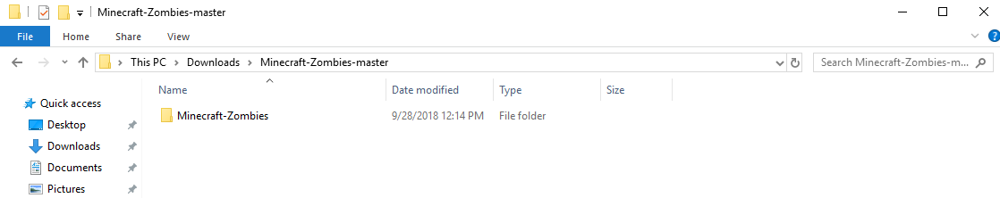

## 1.2 Copy the folder into the appropriate Minecraft save location
On Windows:

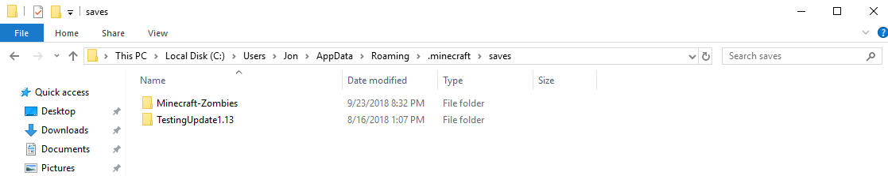

On Linux:
```bash
# From command line:
cp -r ~/Downloads/Minecraft-Zombies ~/.minecraft/saves
```

# 2. Game Setup
Due to changes in the Minecraft 1.13 release, this game only works as of release 1.12.x. This isn't a problem though since we can use the launcher to select this release instead

## 2.1 Start the Minecraft Launcher and select `Launch options`

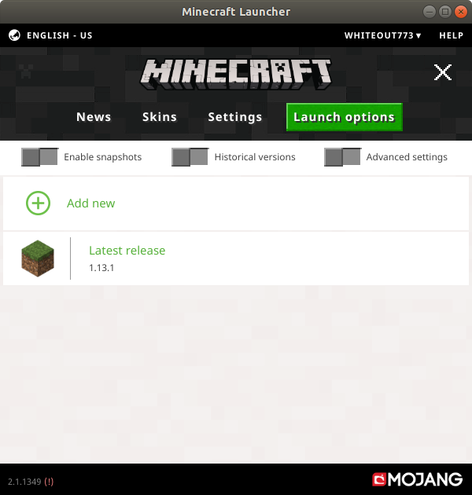

## 2.2 Add release 1.12.x as an alternate option

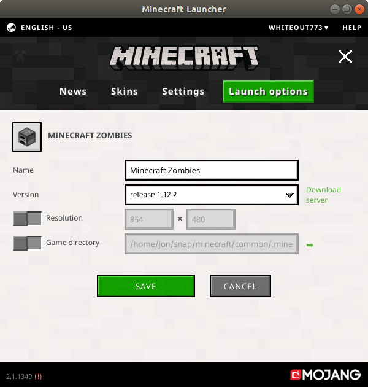

## 2.3 Select release 1.12.x as the active version
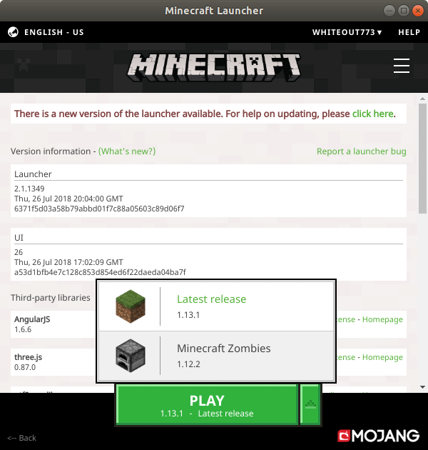

# 3. Gameplay
Start Minecraft and check out the level you just added!

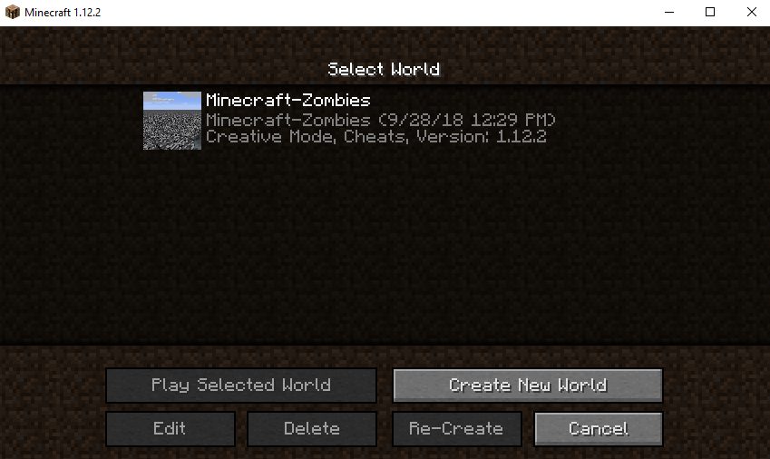
>Note: If nothing shows up at this screen, check that you have copied the folder to the correct location, and that no parent folders exist

    (Desired file structure)
    .../minecraft/saves/
    └── Minecraft-Zombies/
       ├── advancements/
       ├── data/
       └── etc...

    (Possible incorrect file structure)
    .../minecraft/saves/
    └── Minecraft-Zombies-master/       <-- Incorrect parent folder
        └── Minecraft-Zombies-master
            ├── advancements/
            ├── data/
            └── etc...

## 3.1 First steps

#### After loading the level, you should have spawned in the main room. No zombies will spawn yet, but that's a good thing
### 3.1.1 Locate the "Reset" and "Start" buttons (under the stairs) and press them in that order: Reset, then Start
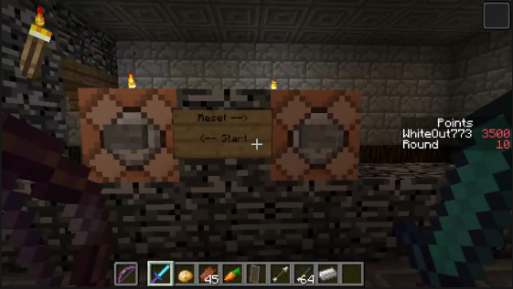

#### Cool! You just started the game!
#### You were just teleported to the center of the first room, given 3 Grenades and 200 points
#### Oh, also Zombies are spawning...
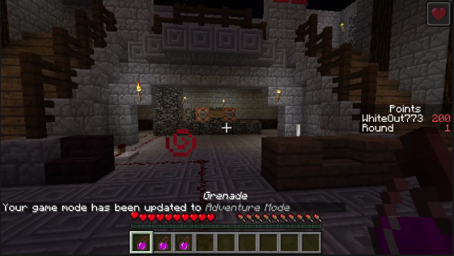

>You will notice the gamemode is now "Adventure", so don't worry about breaking blocks

> Also you have a small health regeneration enchantment, but it's quite slow!

### 3.2 Use your points to buy weapons or open doors, just like the original game
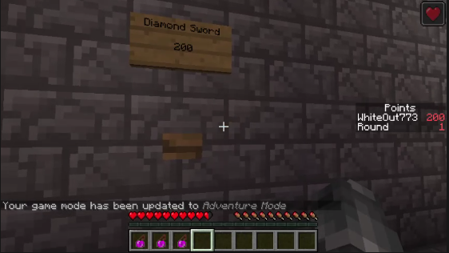

### 3.3 Survive!
#### Tip: Grenades can help a lot, but don't give you any points
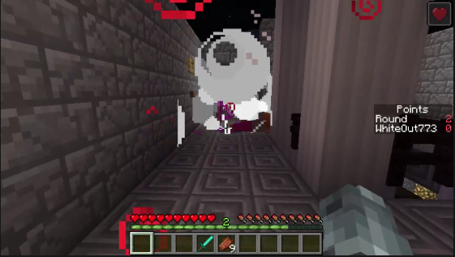

# 4. Editing
It is Minecraft, after all; what if you want to make changes?
#### Go crazy! And submit a pull request if you make something you want to share
>The program structure is entirely made up of command blocks placed in and around the map. The core functions are outside:

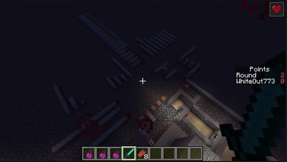

>But room/weapon purchases are built-in.

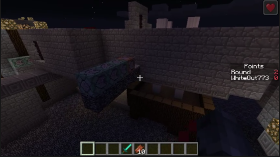

#### Helpful links for using command blocks (Just remember it needs to be for release 1.12):
* https://minecraft.gamepedia.com/Commands
* https://minecraft.gamepedia.com/Scoreboard